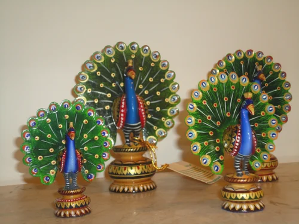
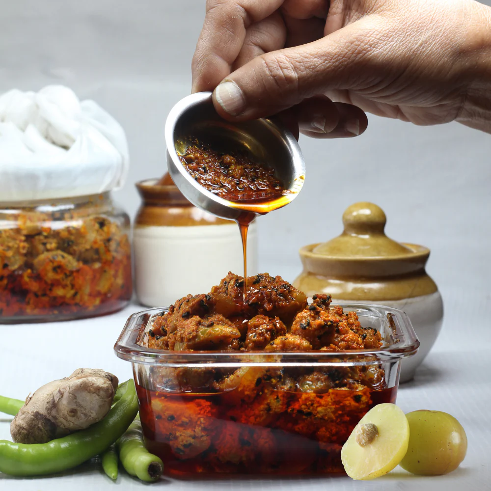
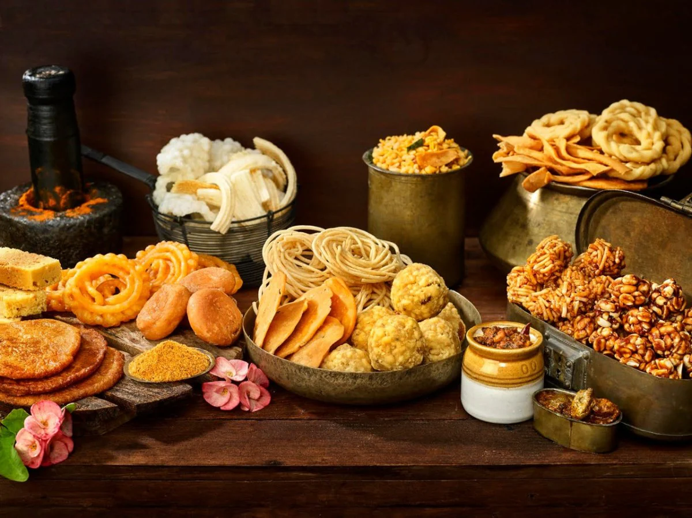

# ✨ Golden Hands ✨

**Empowering India's Elders, One Handmade Treasure at a Time!**



---

## 🥇 What is Golden Hands?

Golden Hands is a heartwarming web project that celebrates the artistry, wisdom, and love of India's senior citizens. Here, you'll find:

- **Homemade Pickles** that taste like childhood summers 🍋
- **Handmade Crafts** that brighten up any home 🪔
- **Traditional Snacks** that bring back memories with every bite 🍘

All made by our talented elders, each with a story, a smile, and a sprinkle of nostalgia.

---

## 🚀 Why Golden Hands?

- **Support Senior Artisans:** Every purchase helps an elder earn with dignity and joy.
- **Preserve Traditions:** From secret pickle recipes to classic crafts, we keep heritage alive.
- **Spread Happiness:** Bring home products made with love, not just machines.

---

## 🛍️ What's Inside?

### 🥒 Pickles



- Mango, Lemon-Chilli, Mixed Veg, Garlic, Amla, and Green Chilli
- Sun-cured, spiced, and packed with grandma's love

### 🎨 Crafts


- Hand-painted diyas, tote bags, bamboo baskets, wooden toys, clay pots, wall hangings
- Each piece is unique, just like its maker

### 🍪 Snacks



- Besan Ladoo, Mathri, Chivda Mixture, Shakkarpara, Papad, Namakpare
- Fresh, crunchy, and made with real ingredients

---

## �� Meet the Makers

> "Our elders may not be professional artisans, but their skills, love, and life experience shine through every product."

- **Savitri Amma:** Mango pickle queen
- **Ramesh Chacha:** Wooden toy storyteller
- **Pushpa Didi:** Snack magician
- **Kiran Uncle:** Diyas and clay pots master
- ...and many more!

---

## 🖥️ Tech Stack

- **HTML5 + CSS3** (with Bootstrap 5 for modern, responsive layouts)
- **Custom CSS** for a warm, inviting look (`assets/main/style.css`)
- **Image-rich galleries** for every product category

---

## 📁 Project Structure

```
/assets
  /crafts      # All crafts images
  /pickles     # All pickles images
  /snacks      # All snacks images
  /main        # Shared CSS
index.html     # Main landing page
crafts.html    # Crafts gallery
pickles.html   # Pickles gallery
snacks.html    # Snacks gallery
```

---

## 🌟 How to Use

1. **Clone this repo:**  
   `git clone https://github.com/yourusername/goldenhands.git`
2. **Open `index.html` in your browser.**
3. **Browse, smile, and get inspired!**

---

## 💡 Want to Contribute?

- Add new elders' stories or products
- Improve the design or accessibility
- Help us reach more people!

**PRs are welcome!**

---

## 📣 Shoutout

This project is dedicated to every grandparent, parent, and elder whose hands have shaped our lives. Thank you for your love, your stories, and your Golden Hands.

---

## 📬 Contact

- Email: info@goldenhands.com
- Phone: (555) 123-4567

---

> "Handcrafted with love and experience."

---

**Give us a ⭐ if you believe in celebrating our elders!** 